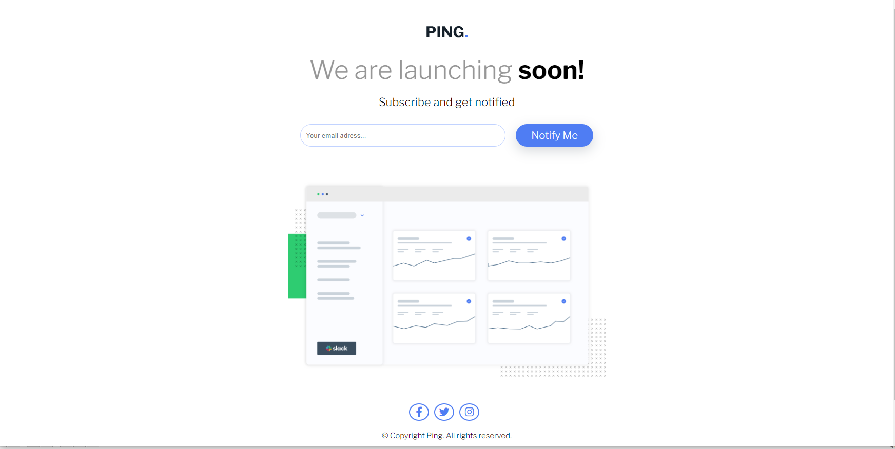

# Frontend Mentor - Ping single column coming soon page

This is a solution to the [Ping single column coming soon page on Frontend Mentor](https://www.frontendmentor.io/challenges/ping-single-column-coming-soon-page-5cadd051fec04111f7b848da). Frontend Mentor challenges help you improve your coding skills by building realistic projects.

## Table of contents

- [Overview](#overview)
  - [Screenshot](#screenshot)
  - [Links](#links)
- [My process](#my-process)
  - [Built with](#built-with)
  - [What I learned](#what-i-learned)
  - [Continued development](#continued-development)
- [Author](#author)

## Overview

### Screenshot

### Links

- Solution URL: [github](https://github.com/Fabzus/Ping-single-column-coming-soon-page)
- Live Site URL: [github](https://fabzus.github.io/Ping-single-column-coming-soon-page/)

## My process

### Built with

- Semantic HTML5 markup
- CSS custom properties
- Flexbox
- Mobile-first workflow
- Javascript
- Regex

### What I learned

A great oportunity to learn Javascript and to use Regex

### Continued development

I would like to change the mobile error status

## Author

- Balog Alin
- linkedIn - [@alinbalog](https://www.linkedin.com/in/alinbalog/)
- github - [@Fabzus](https://github.com/Fabzus)
- Frontend Mentor - [@Fabzus](https://www.frontendmentor.io/profile/Fabzus)
